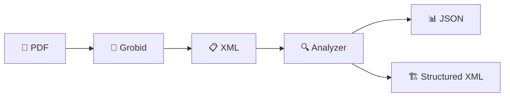

# 🐍 Analizador de Tesis con Grobid

<div align="center">


*Un sistema inteligente para procesar y analizar documentos académicos usando Grobid*

</div>

---

## 👥 **Equipo de Desarrollo**

<div align="center">

### 🎓 **Tesis de Licenciatura**

<table>
<tr>
<td align="center" width="50%">

**👨‍🎓 Estudiante**
```
José de Jesús Hernández Vázquez
Ingeniería en Sistemas Computacionales
CIMAV - Centro de Investigación 
en Materiales Avanzados
```

</td>
<td align="center" width="50%">

**👨‍🏫 Asesor**
```
Juan Calderón
Maestro
Tecnologías de la Información
CIMAV - Centro de Investigación 
en Materiales Avanzados
```

</td>
</tr>
</table>

### 🏛️ **Institución**
**Centro de Investigación en Materiales Avanzados (CIMAV)**  
*Chihuahua, México*

</div>

---

## 📦 **Contenedores del Proyecto**

### 🔧 **Entorno Técnico**
```yaml
🐍 Python: 3.13.7
🐳 Docker: Requerido para Grobid
🌐 Grobid Server: 0.8.0
📄 Formato de entrada: PDF
📋 Formato de salida: XML + JSON
```

### 📚 **Dependencias Principales**
```python
# Core Libraries
requests     # 🌐 Comunicación HTTP con Grobid
pathlib      # 📁 Manejo moderno de rutas
xml.etree    # 🔍 Procesamiento XML nativo
json         # 📊 Serialización de datos
glob         # 🔎 Búsqueda de archivos
difflib      # 📝 Comparación de textos
```

### 🏗️ **Arquitectura del Sistema**
```
📁 Proyecto/
├── 🔬 xml_analyzer.py          # Analizador inteligente de XML
├── ⚙️  process_thesis_with_grobid.py  # Procesador principal
├── 🐳 docker-compose.yml       # Configuración de Grobid
└── 📖 README.md                # Esta documentación
```

---

## 🚀 **Inicio Rápido**

### 1️⃣ **Levantar Grobid**
```bash
# Opción A: Docker Compose (Recomendado)
docker-compose up -d

# Opción B: Docker directo
docker run --rm -it -p 8070:8070 lfoppiano/grobid:0.8.0
```

### 2️⃣ **Ejecutar el Procesador**
```bash
python process_thesis_with_grobid.py
```

### 3️⃣ **Analizar Resultados**
```bash
python xml_analyzer.py
```

---

## 🧠 **Componentes Inteligentes**

### 🔬 **GrobidXMLAnalyzer**
> *El cerebro del análisis de documentos*

<details>
<summary><b>🎯 Métodos Principales</b></summary>

#### `analyze_xml_file(xml_path)`
- **Propósito**: Analiza un archivo XML individual de Grobid
- **Entrada**: Ruta del archivo XML
- **Salida**: Diccionario con metadatos, contenido y referencias
- **Características**: Manejo robusto de errores y múltiples encodings

#### `extract_metadata(root)`
- **Función**: Extrae información bibliográfica
- **Extrae**: Título, autores, fecha, abstract
- **Formato**: Diccionario estructurado

#### `categorize_section(title, content)`
- **Inteligencia**: Clasifica secciones automáticamente
- **Categorías**: Resumen, introducción, metodología, resultados, etc.
- **Algoritmo**: Similitud de texto + palabras clave

#### `detect_language(text)`
- **Capacidad**: Detecta español vs inglés
- **Método**: Análisis de indicadores lingüísticos
- **Precisión**: Basado en las primeras 100 palabras

</details>

### ⚙️ **GrobidThesisProcessor**
> *El motor de procesamiento de documentos*

<details>
<summary><b>🛠️ Funcionalidades Core</b></summary>

#### `check_grobid_status()`
- **Verificación**: Estado del servidor Grobid
- **Diagnóstico**: Conexión y disponibilidad
- **Ayuda**: Instrucciones de solución automáticas

#### `process_pdf_with_grobid(pdf_path)`
- **Procesamiento**: PDF → XML estructurado
- **Timeout**: 5 minutos por documento
- **Validación**: XML bien formado
- **Doble extracción**: Fulltext + Header

#### `find_thesis_files(directory)`
- **Búsqueda**: Patrón `Tesis_*.pdf`
- **Fallback**: Cualquier PDF si no encuentra el patrón
- **Flexibilidad**: Adaptable a diferentes estructuras

</details>

---

## 🎨 **Mapeo de Secciones**

El sistema reconoce automáticamente estas secciones académicas:

<table>
<tr>
<td>

**📝 Estructura Básica**
- Resumen / Abstract
- Introducción
- Antecedentes
- Estado del Arte

</td>
<td>

**🎯 Objetivos**
- Objetivos Generales
- Objetivos Específicos
- Justificación
- Hipótesis

</td>
<td>

**🔬 Desarrollo**
- Metodología
- Resultados
- Análisis
- Conclusiones

</td>
</tr>
</table>

---

## 📊 **Flujo de Datos**



---

## 🎛️ **Configuración**

### 🌐 **Servidor Grobid**
```python
GROBID_SERVER = "http://localhost:8070"  # Local
# GROBID_SERVER = "http://grobid.example.com"  # Remoto
```

### 📁 **Directorios**
```python
THESIS_DIRECTORY = "Rag/tesis"        # PDFs de entrada
OUTPUT_DIRECTORY = "output/grobid_xml" # XMLs de salida
```

---

## 🎯 **Características Destacadas**

### ✨ **Inteligencia Artificial**
- 🧠 **Categorización automática** de secciones académicas
- 🌍 **Detección de idioma** (español/inglés)
- 🔍 **Similitud semántica** para clasificación
- 📊 **Análisis estructural** de documentos

### 🛡️ **Robustez**
- 🔄 **Manejo de errores** comprehensivo
- ⏱️ **Timeouts configurables**
- 🔧 **Múltiples encodings** soportados
- ✅ **Validación XML** automática

### 📈 **Escalabilidad**
- 📁 **Procesamiento en lote**
- 🔄 **Procesamiento asíncrono** preparado
- 📊 **Reportes detallados**
- 🏗️ **Arquitectura modular**

---

## 🎪 **Ejemplo de Uso**

```python
# Crear analizador
analyzer = GrobidXMLAnalyzer()

# Analizar un XML específico
result = analyzer.analyze_xml_file("mi_tesis.xml")

# Procesar directorio completo
results = analyzer.analyze_directory("output/grobid_xml")

# Generar XML estructurado personalizado
analyzer.generate_structured_xml(result, "tesis_estructurada.xml")
```

---

## 🏆 **Resultados Esperados**

Al finalizar el procesamiento obtendrás:

| 📄 **Archivo** | 📝 **Descripción** | 🎯 **Propósito** |
|---|---|---|
| `*_fulltext.xml` | XML completo del documento | Análisis detallado |
| `*_header.xml` | Solo metadatos | Información bibliográfica |
| `*_structured.xml` | XML categorizado | Estructura académica |
| `thesis_analysis.json` | Resumen en JSON | Procesamiento posterior |

---

<div align="center">


*Desarrollado para la Tesis de Licenciatura de CIMAV*

</div>